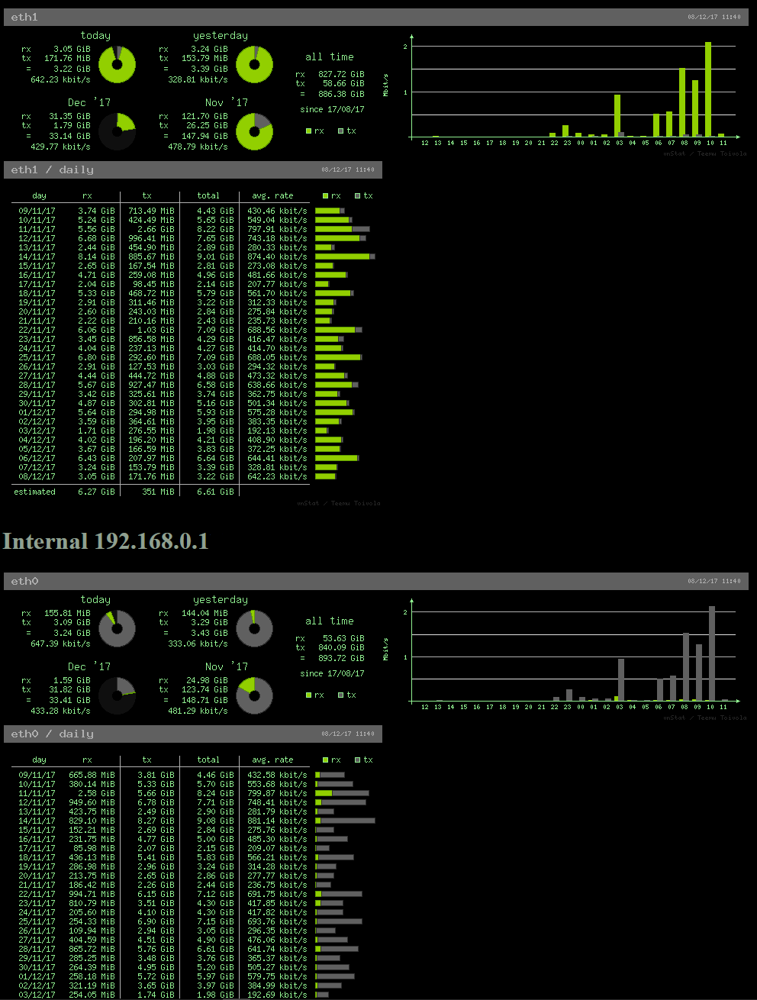

# rpi-router-skel
Raspberry Pi 3 router skeleton
Skeleton for Home router

It's only skeleton, you should install packages and replace configs manually

eth0 internal

eth1 external

**Services**

* iptables (with ipset fixes)
* vnstatd
* dnsmasq
* minissdpd
* lighttpd

